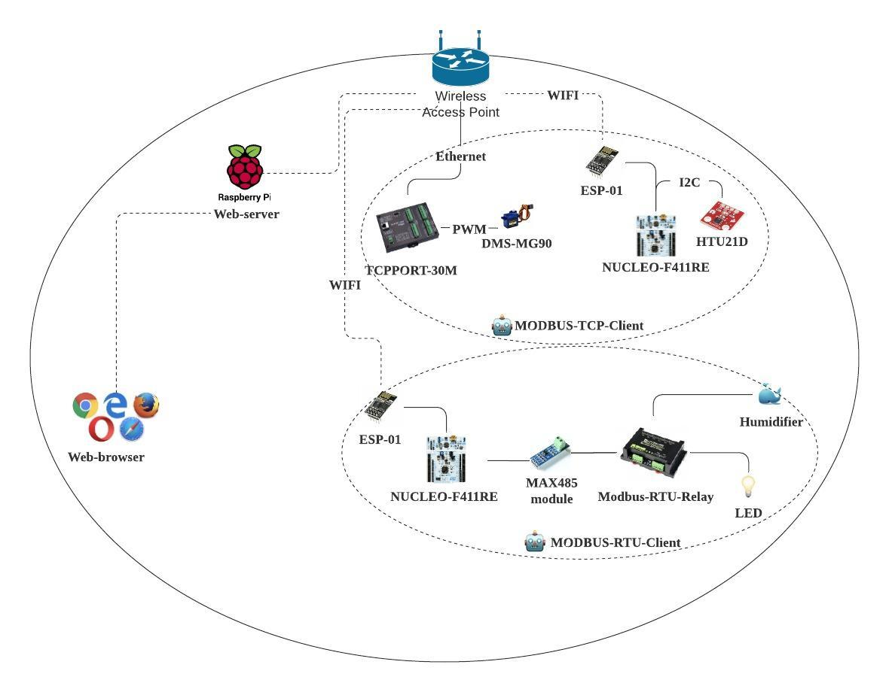

# 🏠 Bethel324-control-system
벧엘관 324호 사는 두 남자👨🏻‍💻👨🏻‍💻의 웹 기반 제어 시스템 구현
     
## Introduction 🔥
저희는 벧엘관 324호에 살고 있습니다. 기숙사 생활에는 고정적으로 반복되는 몇 가지 일들이 있고, 이러한 일들이 저희를 피곤하게 만듭니다. 방을 비울 때는 방문을 잠그고, 밤 11시가 되면 소등하고, 자기 전에 편안한 잠을 위해 가습기를 틉니다. 이러한 일들을 자동으로 혹은 스마트폰 터치 하나로 할 수 있다면 얼마나 편할지 기대하는 마음으로 **🏠 Bethel324-control-system**을 구현하기로 했습니다.
     
## System overview 🔮

     
## Features ✨
로컬 네트워크 상에서 웹 브라우저를 통해 아래와 같은 기능들을 수행할 수 있습니다.
1. 💡 LED 상태 (on/off) 확인 및 제어
2. 💦 가습기 상태 (on/off) 확인 및 제어
3. 🚪 문 잠김 상태 (lock/ unlock) 확인 및 제어
4. 💧 습도 (0~100%)확인
    
## SW configuration 💻
1. Modbus-RTU-Client
   - mbed-os-6.11.0
     
2. Modbus-TCP-Client
   - mbed-os-6.11.0
     
3. Web server
   - Linux raspberrypi 5.4.72-v7l+
   - Flask 1.0.2
   - Python 3.7.3
     
## HW configuration ⚙️
1. MODBUS-RTU-Client 🤖
    1. [MODBUS RTU RELAY](https://www.waveshare.com/modbus-rtu-relay.htm)
    2. [MAX485 Module](http://www.openimpulse.com/blog/wp-content/uploads/wpsc/downloadables/MAX485-Datasheet.pdf)
    3. [STM32 Nucleo-64 board](https://www.st.com/resource/en/user_manual/dm00105823-stm32-nucleo64-boards-mb1136-stmicroelectronics.pdf)
    4. [ESP-01](https://www.microchip.ua/wireless/esp01.pdf)
     
2. MODBUS-TCP-Client 🤖
   1. [TCPPORT-30M](http://comfilewiki.co.kr/ko/doku.php?id=tcpport:index)
   2. [DMS-MG90](https://components101.com/motors/mg90s-metal-gear-servo-motor)
   3. [STM32 Nucleo-64 board](https://www.st.com/resource/en/user_manual/dm00105823-stm32-nucleo64-boards-mb1136-stmicroelectronics.pdf)
   4. [ESP-01](https://www.microchip.ua/wireless/esp01.pdf)
   5. [HTU21D](https://cdn-shop.adafruit.com/datasheets/1899_HTU21D.pdf)
     
3. Web server 🤖
   1. [Raspberry Pi4 Model B](https://www.raspberrypi.org/documentation/hardware/raspberrypi/bcm2711/rpi_DATA_2711_1p0_preliminary.pdf)
     
## Team composition 👨🏻‍💻🧑🏻‍💻
- 채영민 : BE, HW 환경 설정 및 구성 등 [@dudals5018](https://github.com/dudals5018)
- 김석진 : FE, MODBUS-RTU-Client, MODBUS-TCP-Client 등[@SukJinKim](https://github.com/SukJinKim)
   
## Links 🔗
Youtube : [한동대학교 21-1학기 임베디드 파이널 프로젝트 : Bethel324 control system 시현 영상](https://www.youtube.com/watch?v=UDMhM5lJeyQ)
Blog : [🏠Bethel324-control-system에 대하여](https://alinew.tistory.com/92), [🏠Bethel324-control-system을 구현하면서 배우고 성장한 점들](https://alinew.tistory.com/93)